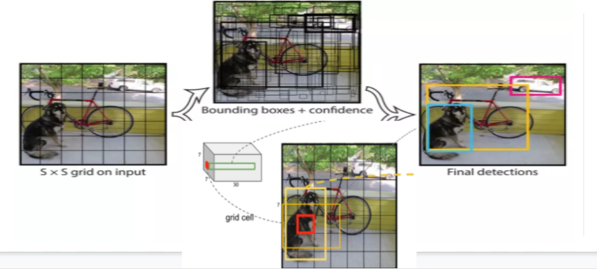
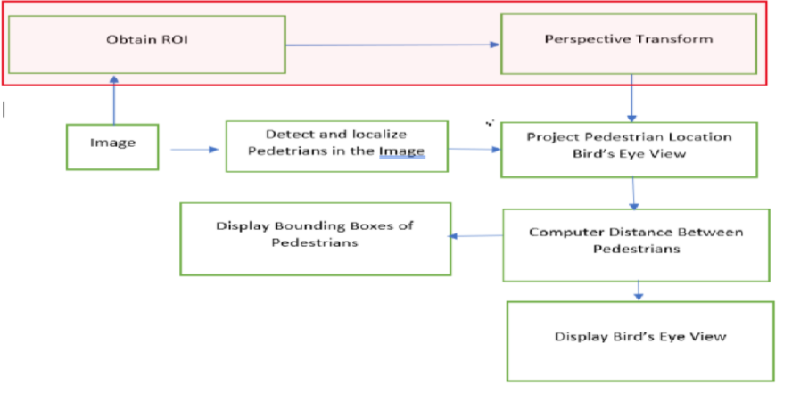
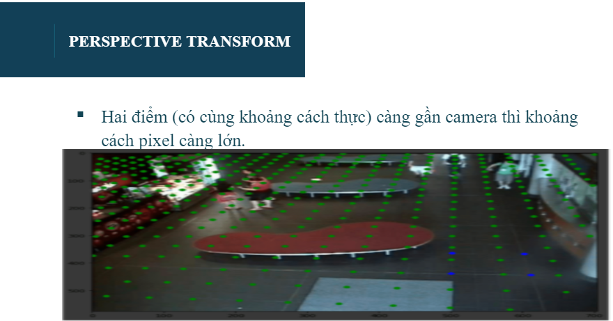
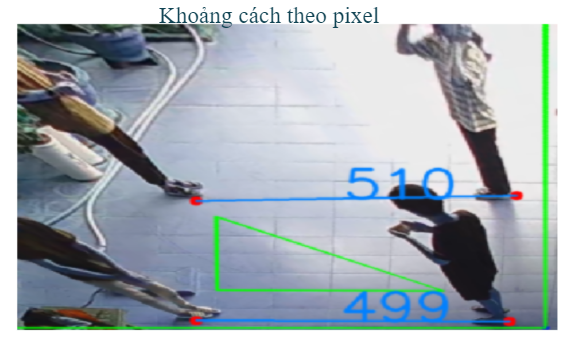

# Social distance detection
## Input và Output:
- Input: Đầu vào 1 video.
- Output: Bounding box tương ứng cho mỗi người ( xanh  không vi phạm, đỏ vi phạm) về khoảng cách và vị trí của người trên bird-eye-view.
# Sử dụng Yolov4:

# Các bước xử lý

# Chi tiết các bước

Vì vậy dựa trên tọa độ 2D thì không thể tính chính xác khoảng cách. Chúng ta tiến hành chuyển về dạng top-down để tính toán lại khoảng cách trên tọa độ thực. 

